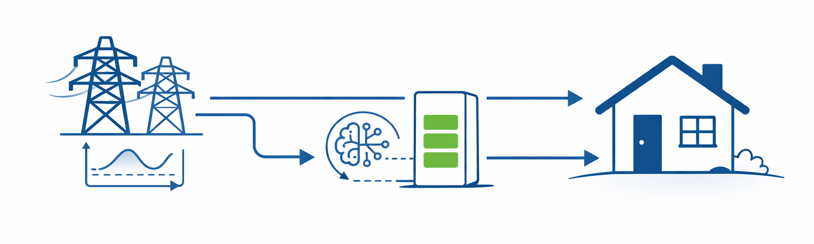

<div style="background-color: #ffffff; color: #000000; padding: 10px;">

<h1> Workshop: Reinforcement Learning II - Implementation </h1>
</div>

This repository hosts the materials of the Reinforcement Learning II workshop of the AI Service Center Berlin Brandenburg. In part two of this workshop series, we use a simple illustrative example, such as managing an energy storage system, to demonstrate the step-by-step process of translating a given task into a RL setup.

## The Problem




You have a home battery. Electricity prices vary throughout the day: cheap at night when demand is low, expensive during evening peaks. Your household has energy demands that must be met at all times.

Without a battery, you simply buy electricity from the grid at whatever the current price is. With a battery, you have a choice: **charge when electricity is cheap, and discharge when it's expensive**. The question is: when exactly should you charge, how much, and when should you discharge?

Prices and consumption patterns are noisy, partially predictable, but its dynamics are unknown. It is unclear what the optimal policy is. This makes it a fit for **reinforcement learning**: an agent can learn an optimal strategy through trial and error.

This environment is **intentionally kept simple** as a teaching example for RL environment design. Simplifications like 100% charging efficiency, no grid sell-back, and synthetic data let you focus on the core RL concepts (observation/action/reward formulation) without getting lost in domain complexity.

In Level 1, we assume a perfect battery: 100% charging efficiency and no battery degradation over time.
In Level 2, we introduce a degradation mechanic: the battery loses health when charged too aggressively or when the state of charge is too low or too high. This creates a trade-off for the optimal policy: reduce energy costs now but damage the battery, or operate more conservatively to preserve its long-term health.

## Features

- **10 years of synthetic hourly data** — electricity prices and household load with daily/weekly patterns
- **Gymnasium-compatible environment** — battery storage simulation following the gymnasium API
- **5 guided Jupyter notebooks** - core of the workshop
- **Baseline comparisons** — heuristic, linear programming (LP), and model predictive control (MPC)
- **RL training** — PPO and SAC agents via Stable-Baselines3

## Setup and Installation

### Prerequisites

- Python >= 3.10
- [uv](https://docs.astral.sh/uv/) (Python package manager)
- [VS Code](https://code.visualstudio.com/) with the [Jupyter extension](https://marketplace.visualstudio.com/items?itemName=ms-toolsai.jupyter) (recommended)

### Quick Start

1. Clone the repository:
   ```bash
   git clone https://github.com/aihpi/workshop-rl2-implementation.git
   cd workshop-rl2-implementation
   ```

2. Install dependencies:
   ```bash
   uv sync
   ```

3. Open the project in VS Code and start with the first notebook:
   ```
   01_workshop/notebooks/00_explore_data.ipynb
   ```

## Workshop Structure

Work through the notebooks in order:

| # | Notebook | Description |
|---|----------|-------------|
| 0 | `00_explore_data` | Familiarize yourself with the data |
| 1 | `01_design_heuristic_policy` | Design a simple rule-based charging policy |
| 2 | `02_implement_environment` | Implement the 4 core methods of the environment |
| 3 | `03_train_rl_without_battery_degradation` | Train PPO/SAC agents and compare against baselines |
| 4 | `04_train_rl_with_battery_degradation` | Extend the environment with battery health modeling |

## Repository Overview

```
├── 01_workshop/              Workshop materials
│   ├── envs/battery_env.py   Skeleton environment (you implement this!)
│   ├── notebooks/            Guided Jupyter notebooks (00–04)
│   └── utils.py              Helper functions
├── 02_solutions/             Reference implementations (don't peek!)
├── 03_data/                  Synthetic dataset (10 years, 87,600 hours)
├── scripts/                  Data generation script
└── tests/                    Test suite for the environment
```

### Battery Specifications

| Parameter | Value | Notes |
|-----------|-------|-------|
| Capacity | 10.0 kWh | Maximum energy the battery can store |
| Max charge rate | 2.5 kW | Maximum power in/out per hour |
| Efficiency | 100% | No energy losses (kept simple for teaching) |
| Initial SoC | Random | Each episode starts with a random charge level |

### RL Formulation

**Observation** (5 + 2 × forecast_horizon values, all normalized to [0, 1]):

| Component | Description |
|-----------|-------------|
| State of Charge | How full is the battery? |
| Battery Health | Current health level (for degradation) |
| Hour of Day | Time of day (0 = midnight, 0.5 = noon) |
| Current Price | Electricity price this hour |
| Current Load | Household consumption this hour |
| Forecasts | Noisy price and load forecasts for the next hours |

**Action**: A single continuous value in [-1, 1]
- -1 = discharge at maximum rate
- 0 = do nothing
- +1 = charge at maximum rate

**Reward**: The negative electricity cost this hour. The agent minimizes costs by learning when to charge (cheap hours) and discharge (expensive hours).

## Your Task

Open `01_workshop/envs/battery_env.py`. The skeleton provides all the infrastructure — you implement **4 methods**:

1. **`_calculate_reward`** — Compute the electricity cost for one time step
2. **`_get_obs`** — Assemble the observation vector
3. **`reset`** — Initialize a new episode
4. **`step`** — Execute one time step (the main RL loop)

Verify your implementation with the test suite:

```bash
uv run pytest tests/ -v
```

Afterwards you can continue with notebooks 03 and 04.

## References

- [Gymnasium Documentation](https://gymnasium.farama.org/)
- [Stable-Baselines3 Documentation](https://stable-baselines3.readthedocs.io/)

## License

This project is licensed under the MIT License — see [LICENSE](LICENSE) for details.

---

## Acknowledgements


The [AI Service Centre Berlin Brandenburg](http://hpi.de/kisz) is funded by the [Federal Ministry of Research, Technology and Space](https://www.bmbf.de/) under the funding code 01IS22092.
